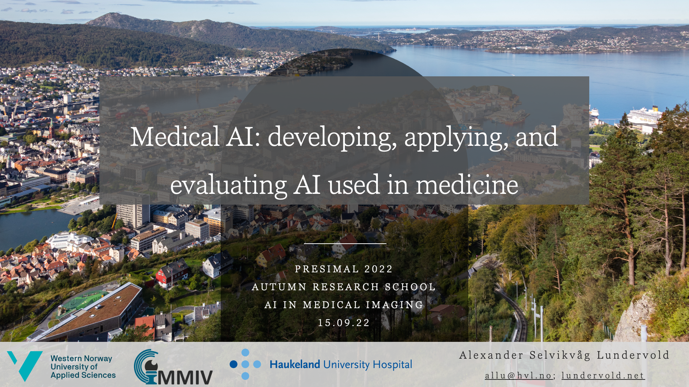
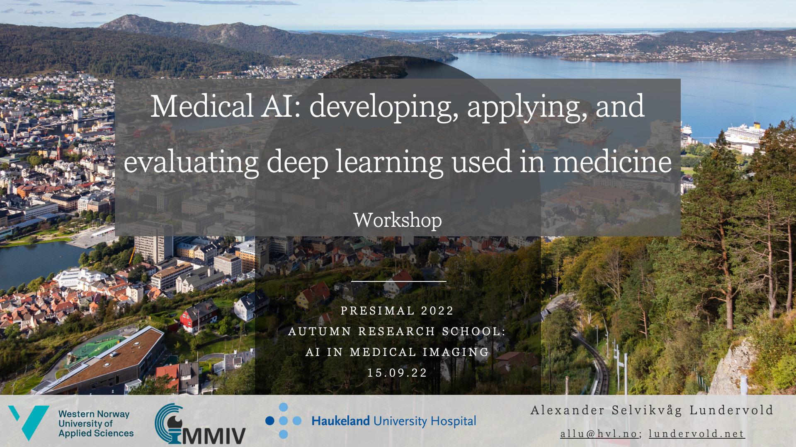

# PRESIMAL 2022 workshop

> Part of the PRESIMAL Autumn Research School on _[Artificial Intelligence in Medical Imaging](https://mmiv.no/3937-2/)_, Sept 14&ndash;16, 2022. 

_04.09.22, [Alexander Selvikvåg Lundervold](https://alexander.lundervold.com/)_

The lecture and the accompanying workshop take you on a short guided tour of deep learning in the context of medical imaging, showcasing AI-driven biomarker analysis.

## Slides

Here you'll find PDF versions of the lecture slides.

### Slides from presentation

Slides from the presentation _Medical AI: Development, Application, and Evaluation of Machine Learning in Medicine_.

***TBA***

### Slides from the workshop

The workshop builds upon the earlier presentation and provide (i) an introduction to deep learning (connected to notebook `1.0-asl-segmentation-brain_tumor_segmentation.ipynb` linked below), (ii) hands-on example of AI-driven biomarker analysis, and (iii) a quick look at our [fastMONAI](https://fastmonai.no) deep learning library. 

***TBA***

## Notebooks

The hands-on part of the workshop is based on the first two notebooks linked below, as well as the tutorial notebooks of [fastMONAI](https://fastmonai.no). The ones marked as _"extra"_ will be mentioned as possible self-study material but will not be covered in any detail. 

| Notebook    |      1-Click Notebook      |
|:----------|------|
|  [1.0-asl-segmentation-brain_tumor_segmentation.ipynb](https://nbviewer.org/github/MMIV-ML/presimal2022/blob/master/nbs/1.0-asl-segmentation-brain_tumor_segmentation.ipynb)  | 
|  [2.0-asl-brain_tumor_analysis_radiomics.ipynb](https://nbviewer.org/github/MMIV-ML/presimal2022/blob/master/nbs/2.0-asl-brain_tumor_analysis_radiomics.ipynb)  | 
|  [extra-3.0-asl-nnets_building_blocks.ipynb](https://nbviewer.org/github/MMIV-ML/presimal2022/blob/master/nbs/extra-3.0-asl-nnets_building_blocks.ipynb)  | 
|  [extra-4.0-asl-tumor_grading.ipynb](https://nbviewer.org/github/MMIV-ML/presimal2022/blob/master/nbs/extra-4.0-asl-tumor_grading.ipynb)  | 

### fastMONAI

You'll find the tutorial notebooks through this link:
 

